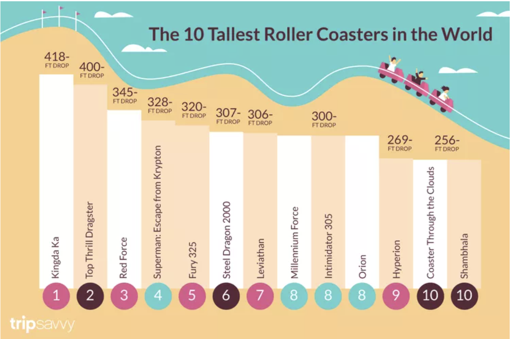

| [home page](https://tstum-wq.github.io/tstum-dataviz-portfolio/) | [data viz examples](dataviz-examples) | [critique by design](critique-by-design) | [final project I](final-project-part-one) | [final project II](final-project-part-two) | [final project III](final-project-part-three) |

# The 13 Biggest Roller Coaster Drops in the World
This is the original data visualization that I used for analysis.  

_For each step below, you should document your progress as you move forward.  In terms of tone, think of the writeup as though you're keeping journal of your step-by-step process.   You should include a any insights you gained from the critique method, and what it led you to think about when considering the redesign.  You should talk about how you moved next to the sketches, and any insights you gleaned from your user feedback.  Document what you changed based on the user feedback in your redesign.  Finally, talk about what your redesigned data visualization shows, why you selected the data visualization you did, and what you attempted to show or do differently._

_You can include screenshots, sketches or other artifacts with your narrative to help tell the story of how you moved through the process.  Again, make sure to avoid including any personally identifying information about your interviewees (don't list full names, etc.).  While this template serves as a guide, make sure to reference the assignment writeup on Canvas for the official guidance.  This template does not include all guidance mentioned on the assignment page._

## Step one: the visualization

*Source: [TripSavvy - Tallest Roller Coasters in the World](https://www.tripsavvy.com/tallest-roller-coasters-in-the-world-3226411)*

I selected this visualization to critique because of its illustrative design. It initially presents an overall pleasing illustration that uses color and theme to mimic the fun nature of an amusement park. It seemed clear from the article that the content and presentation align with the target audience of teens or thrill-seekers. Plus, I have always loved riding roller coasters - the wilder, the better!

This choice allowed me to reflect on the entire ethos of this design. For example, who was this visual for? Other questions included:
Beyond general thrill-seekers, who is the specific intended audience?
What specific narrative or trend does the data demonstrate? 
Is the visualization declarative (stating a fact) or exploratory (inviting the user to find their own insights)?
Is the approach primarily conceptual (metaphor-heavy) or data-driven (focused on precise values)? 
Ultimately, what is the visualization attempting to communicate?

_Include link to the original data visualization (or screenshot - make sure to correctly cite your sources, etc.).  Include paragraph or two on why you selected this particular data visualization.  For obvious reasons, the data visualization you select should come from a publicly accessible source._

## Step two: the critique

## Usefulness: 
I'd give this a 5 out of 10 score. While the visualization successfully attracts its target demographic through niche content, the presentation is not fully optimized. Although it identifies the largest roller coaster drops, the viewer encounters excessive visual noise and a lack of clarity. While the underlying data is sound, the delivery hinders the user's ability to extract value efficiently.

## Completeness: 
The visualization is "complete" in terms of data density, yet this abundance creates a significant distraction. Much of the included information feels arbitrary; for instance, inconsistent color application creates more confusion than insight, detracting from the chart’s primary purpose.

## Perceptibility: 
While a bar chart is a logical choice for this data, the specific selection and orientation of the bars hinder a clear narrative. The piece functions more as a thematic illustration than a clear example of data storytelling. For example, while the coaster graphic slopes downward from left to right to mirror the rankings, it serves as a decorative element rather than a functional aid to data interpretation.

## Truthfulness: 
The visualization provides a generally accurate representation of operating roller coasters. Notably, the source article includes two coasters that are not yet fully constructed; excluding these from the visual was an appropriate editorial choice. However, the title is somewhat ambiguous, suggesting the "10 Tallest Roller Coasters" when the data actually focuses on the "Biggest Drop." The relationship between total height and drop height remains unclear to the viewer. 

## Intuitiveness: 
The chart lacks immediate clarity; deeper analysis reveals increasing discrepancies. The flow follows a standard left-to-right hierarchy, but the central illustration—featuring a large "hump"—contradicts the intended "high-to-low" visual logic. Furthermore, the text's vertical orientation makes reading difficult, and the numbering system uses a non-consistent color palette without a corresponding legend. 

## Aesthetics: 
The design is over-saturated with competing colors, shapes, and random assignments. These choices push the project into the realm of illustration rather than functional data visualization. Labeling is also redundant; the repetitive use of "FT. DROP" is unnecessary if the title is properly defined. Additionally, coasters with tied heights are implied rather than explicitly labeled. Alternating colors on the bars, with two side-by-side being the same color, is inconsistent and unnecessary. 

## Engagement: 
The visualization is likely effective for its primary audience of teenagers and thrill-seekers. The bright, stylized theme and "fun" aesthetic align well with the interests of a younger demographic. 

## Overall observations: 
My primary takeaway is that simplifying the design by removing distracting elements will clarify the data story. Currently, excessive color distribution, unnecessary illustrations, and awkward labeling are in direct conflict with an otherwise straightforward narrative. 

## Who is the primary audience for this tool? 
Younger thrill-seeker audiences. 
## Do you think this visualization is effective for reaching that audience? 
Moderate. It successfully reaches its audience through a colorful, albeit busy, pop-style theme that highlights top-ranked coasters.

In my redesign, I intend to prioritize the data over the artwork. Using the Visual Vocabulary guide, I will explore more effective design options for ranked content, specifically bar or lollipop charts. I look forward to iterating on these concepts in Tableau and Datawrapper to create a cleaner, more intuitive user experience.

## Step three: Sketch a solution

## Step four: Test the solution

_Before you conduct your interviews, prepare a simple script.  Use this as a guide and as a way to take notes as you go forward. Come up with your own list of questions you want to ask for the selected visualization. Keep the questions broad so you can get the most value out of your feedback. Then, document answers to your questions here._

Questions to ask (modify these for your own interviews): 

- Can you tell me what you think this is?

- Can you describe to me what this is telling you?

- Is there anything you find surprising or confusing?

- Who do you think is the intended audience for this?

- Is there anything you would change or do differently?

Results: 

_Don't identify or share personally identifiable information (PII) about the people you spoke to._
| Question | Interview Group 1 | Interview Group 2 |
| :--- | :--- | :--- |
| **Can you describe what this   chart is telling you?** | Yes, it's about the 13 Biggest   Roller Coasters in the World | [Response 2] |
| **Is there anything you find   surprising or confusing?** | It says 'in the World' but   which countries are represented?   We'd like to know where   they are located. | [Response 2] |
| **Who do you think is the   intended audience?** | [Response 1] | [Response 2] |
| **Is there anything you would   change or do differently?** | [Response 1] | [Response 2] |

| Question | Interview 1 | Interview 2 |
|----------|-------------|-------------|
|          |             |             |
|          |             |             |
|          |             |             |

Synthesis: 

_What patterns in the feedback emerge?  What did you learn from the feedback?  Based on this feedback, come up with what design changes you think might make the most sense in your final redesign._

## Step five: build the solution

_Include and describe your final solution here. It's also a good idea to summarize your thoughts on the process overall. When you're done with the assignment, this page should all the items mentioned in the assignment page on Canvas(a link or screenshot of the original data visualization, documentation explaining your process, a summary of your wireframes and user feedback, your final, redesigned data visualization, etc.)._

## References
_List any references you used here._

## AI acknowledgements
_If you used AI to help you complete this assignment (within the parameters of the instruction and course guidelines), detail your use of AI for this assignment here._

